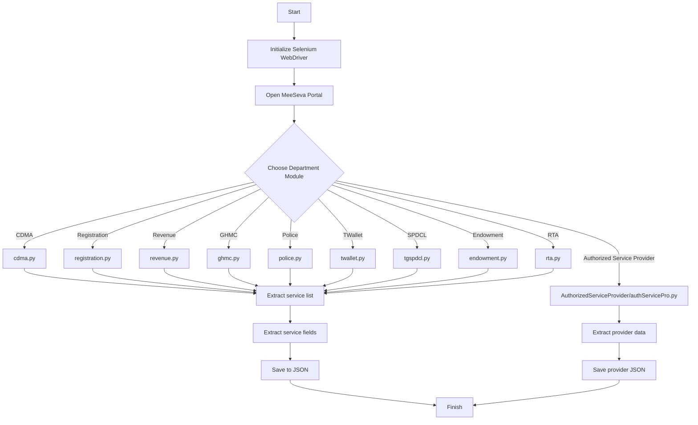

# MeeSeva Scraper Suite

## Overview

The MeeSeva Scraper Suite is a Python-based automation project designed to extract service details from the Telangana MeeSeva portal. It uses Selenium to navigate dynamic web pages, collect structured service metadata, and export department-specific data into JSON files.

This repository includes dedicated scraper modules for multiple MeeSeva departments, such as:
- `cdma.py`
- `registration.py`
- `revenue.py`
- `ghmc.py`
- `police.py`
- `tgspdcl.py`
- `twallet.py`
- `endowment.py`
- `rta.py`
- `cmda.json`, `Revenue.json`, `registration.json`, etc. for generated output data

The `AuthorizedServiceProvider/` directory contains a focused extractor for authorized service provider details.

## Key Features

- Automated navigation of the Telangana MeeSeva web portal
- Department-specific scraping logic for service details
- Resilient Selenium workflows with wait conditions
- JSON export of extracted service metadata
- Modular structure for extension to new departments

## Architecture

The architecture follows a modular scraper pattern: each module is responsible for one department or function, while sharing the same overall workflow:
- Launch browser with Selenium
- Open MeeSeva home page
- Navigate to department-specific section
- Extract service-level fields
- Save data into a JSON file

### Architecture Diagram



## Repository Structure

- `*.py` — Department-specific scraper scripts
- `*.json` — Scraped service data outputs
- `AuthorizedServiceProvider/` — Provider extraction module and sample data
- `scraper.log` — Optional log file for runtime diagnostics

## Prerequisites

- Python 3.11+
- Google Chrome browser
- ChromeDriver (installed automatically by `webdriver-manager`)
- `selenium` Python package
- `webdriver-manager` Python package

## Installation

1. Clone the repository:

```bash
git clone https://github.com/Nitish-Naik/meeseva.git
cd meeseva
```

2. Create and activate a Python virtual environment:

```bash
python3 -m venv venv
source venv/bin/activate
```

3. Install dependencies:

```bash
pip install selenium webdriver-manager
```

## Usage

Run any department script directly using Python. Example:

```bash
python cdma.py
```

Supported modules can be executed similarly, and each script saves a JSON output file named after the department.

Example outputs:
- `cmda.json`
- `registration.json`
- `Revenue.json`
- `nizamabad_data.json`

## Best Practices

- Use a dedicated virtual environment for dependencies
- Run each script individually to isolate extraction logic
- Inspect generated JSON files for completeness after each run
- Extend modules by reusing the existing Selenium navigation and extraction patterns

## Contribution

Contributions are welcome. When adding a new department module, follow the existing scraper pattern:
1. Create a new Python script
2. Implement department navigation logic
3. Extract fields into structured dictionaries
4. Save results to a JSON file

## License

This repository is provided as-is for scraping and research purposes. Ensure compliance with Telangana MeeSeva terms of service before using automated extraction.
